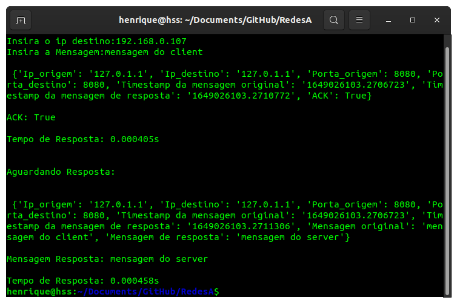
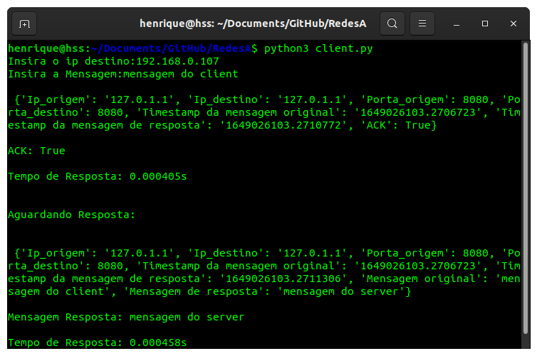

# Chat Linux via UDP


## Descrição
Deve-se criar um chat via terminal do Linux. Portanto, deve-se desenvolver um programa, na linguagem de programação que desejarem, mas que rode exclusivamente no terminal do Linux, que faça:
* Enviar mensagem para um outro programa na sua rede:
  * O programa deve, minimamente, receber do usuário:
    * IP do destino da mensagem;
    * Mensagem;
  * Deve enviar a mensagem para * IP destinado especificado e deve confirmar que a mensagem foi entregue corretamente ao destino.

* Ao mesmo tempo (em paralelo), deve ficar aguardando mensagens oriundas de
qualquer destino e as exibindo na tela.
  * Deve confirmar o recebimento.
  * Deve exibir na tela do usuário (tratar o momento mais adequado para tal, haja visto que o usuário pode estar escrevendo uma mensagem para outro destino).
  * Após, confirmar o recebimento e exibir na tela, seu programa deve possibilitar uma resposta direta ao remetente, sem a necessidade de o usuário especificar o IP, pois a mensagem veio de uma fonte conhecida e deve ter sua resposta enviada a ela.

Para essas comunicações, obrigatoriamente utilize-se de um json com as seguintes informações:

* Envio de mensagem:
  * Ip_origem
  * Ip_destino
  * Porta_origem
  * Porta_destino
  * Timestamp da mensagem
  * Mensagem

* Mensagem de confirmação de recepção (ACK):
  * Ip_origem
  * Ip_destino
  * Porta_origem
  * Porta_destino
  * Timestamp da mensagem original
  * Timestamp da mensagem de resposta
  * ACK (true ou false)

* Mensagem de resposta:
  * Ip_origem
  * Ip_destino
  * Porta_origem
  * Porta_destino
  * Timestamp da mensagem original
  * Timestamp da mensagem de resposta
  * Mensagem original
  * Mensagem de resposta

## Como Executar
* Baixe o arquivo compactado presente nesse repositório.
* Sera necessário dois terminais, um para o cliente e outro para o servidor.
* No primeiro terminal execute o arquivo do servidor - `servidor.py`.
  * ```python3 server.py```
  * Agurde por alguma mensagem que será enviada para este servidor.
  * Após receber uma mensagem é possível responde-la diretamente.
* No segundo terminal execute o arquivo do cliente - `client.py`.
  * ```python3 client.py```
  * Insira o IP do servidor de destino.
  * Insira a mensagem que deseja enviar.

## Exemplo de execução
Para o server:



Para o client:



## Observações
Ao tentar enviar uma request para o servidor quando o mesmo estiver digitando um amensagem, a request estará aguardando, em fila, pela liberação da response desta request anterior, ou seja, o client aguardará pela response da request anterior (de outro client) e pela própria request.

## Colaboradores
* [Derek Freire Quaresma](https://github.com/derekfq/)
* [Henrique Sartori Siqueira](https://github.com/h-ssiqueira/)
* [Rafael Silva Barbon](https://github.com/RafaelBarbon/)
